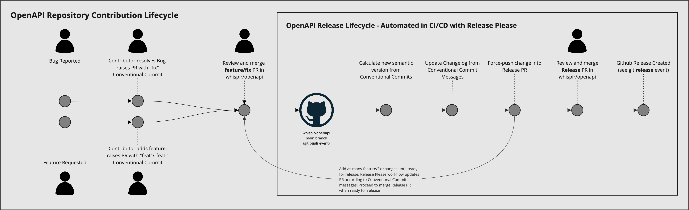
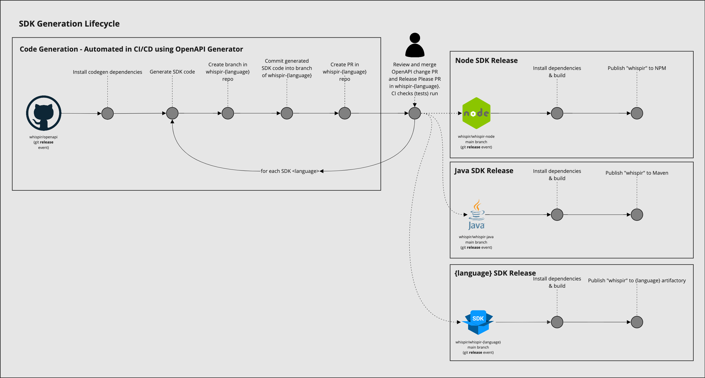

# Whispir SDK Code-Generator

This package is responsible for generating software development kits (SDKs) in various languages, using Whispir's OpenAPI Specification as the source of truth. Whispir uses [OpenAPI Generator](https://openapi-generator.tech/) with customised [Mustache templates](https://mustache.github.io/) to generate these SDKs in many languages. Each SDKs source-code resides in a separate Git repository to decouple OpenAPI specification versioning from SDK versioning, and subsequently, decouple OAS and SDK release management. Whispir uses [semantic versioning](https://semver.org/) across all public repositories.

Quality of SDK documentation and code-completion is ensured through use of the open-source [Spectral](https://docs.stoplight.io/docs/spectral) project to lint and enforce design standards across our APIs. You can find Whispir's Spectral configuration under [`.spectral.json`](https://github.com/whispir/openapi/blob/main/.spectral.json). For example, we include a Spectral rule that ensures each schema attribute has a description; these descriptions flow through to each SDKs resource documentation. Whisipr runs the Spectral linter on all pull requests using a Github action workflow at [`.github/workflows/api-style.yml`](https://github.com/whispir/openapi/blob/main/.github/workflows/api-style.yml).

## Running the Generator

Ensure you have Java installed, it is required by the OAS generator. The easiest way to install is through Brew.
```bash
> brew install java
> sudo ln -sfn $(brew --prefix)/opt/openjdk/libexec/openjdk.jdk /Library/Java/JavaVirtualMachines/openjdk.jdk # symlink the Java runtime
```

Run the generator with the following steps:

```bash
> cd codegen
> yarn # install yarn dependencies
> yarn generate # generate SDK from the OpenAPI Specification
```

## Supported Languages

Various languages are supported in separately published SDKs.

| Language | Repository                                              | OpenAPI Generator                                                                 |
| -------- | ------------------------------------------------------- | --------------------------------------------------------------------------------- |
| Node     | [whispir-node](https://github.com/whispir/whispir-node) | [typescript-node](https://openapi-generator.tech/docs/generators/typescript-node) |
| Java     | [whispir-java](https://github.com/whispir/whispir-java) | [java](https://openapi-generator.tech/docs/generators/java)                       |

## OpenAPI & SDK Generation Release Lifecycle

Whispir makes use of [Github workflows](https://docs.github.com/en/actions/using-workflows) to automate as much of the SDK Generation Lifecycle as possible. The SDK Generation Lifecycle can be broken into two distinct parts:

1. whispir/openapi release lifecycle
2. SDK code generation & whispir/whispir-{language} release lifecycle

The distinct parts have their release lifecycles automated through [Google's Release Please](https://github.com/google-github-actions/release-please-action) Github action, which at a high level, performs the following operations, in this order:

1. On `main` branch [`push`](https://docs.github.com/en/actions/using-workflows/events-that-trigger-workflows#push) events for standard change commits, pickup the [Conventional Commit](https://www.conventionalcommits.org/) type and commit message
   1. If no release PR exists, create one. Determine the new semantic version and create a new changelog entry for that version
   2. If a release PR exists, update the existing PR with the new semantic version and update the existing changelog entry for the version
2. On `main` branch `push` events corresponding to step #1's Release PR being merged, create a [Github Release](https://docs.github.com/en/repositories/releasing-projects-on-github/managing-releases-in-a-repository)

Putting this altogether, we can illustrate step 1 of the release lifecycle as follows, with the "person" symbols representing the human interaction in the process. All other "circle" symbols are automated actions.



At the conclusion of the OpenAPI release lifecycle, the [`release`](https://docs.github.com/en/actions/using-workflows/events-that-trigger-workflows#release) event triggers the SDK generation workflow to run, the SDK generation workflow can be illustrated as follows.



## Adding a New Language

Xero's well documented process for [generating SDKs from OpenAPI Spec using OpenAPI Generator](https://devblog.xero.com/building-sdks-for-the-future-b79ff726dfd6) was crucial in developing the release workflow for Whispir's SDKs. We wanted the release process to be as automated as possible, with the only development touch-points being review and merging of pull requests in the OpenAPI and SDK git repositories. In the spirit of open-source collaboration and continuous improvement, Whispir has open-sourced all source-code and repository configuration responsible for generating our SDKs from the OpenAPI Specification. We welcome all contributions to improve our SDKs.

1. Create a new Github repository from Whispir's [opensource-repo Git template](https://github.com/whispir/opensource-repo), with the git repository named in the format `whispir-{language}` (e.g. `whispir-node` or `whispir-go`). The opensource-repo template provides common opensource repository files such as `LICENSE`, Github issue templates, and a conventional commit release workflow, which is used to semantically version and maintain a changelog for the repository's contents.
   1. Ensure the repository belongs to the `whispir` Github organisation
   2. Under "Settings" in the new repository, make the following changes in each section (all other boxes should be unticked):
      1. "General":
         1. `Features`:
            1. `Issues`: Yes
            2. `Preserve this repository`: Yes
            3. `Discussions`: Yes
         2. `Pull Requests`:
            1. `Allow squash merging`: Yes
               1. Select `Default to pull request title` - this ensures that squash commits reference the conventional-commit pull request title, enabling semantic versioning via conventional commit messages.
            2. `Allow auto-merge`: Yes
            3. `Automatically delete head branches`: Yes
      2. "Branches":
         1. Add a `main` branch protection rule:
            1. `Require a pull request before merging`: Yes
               1. `Require approvals`: Yes
            2. `Require status checks to pass before merging`: Yes
               1. `Require branches to be up to date before merging`: Yes
               2. `Status checks that are required.`:
                  1. `conventional-pr-title`
            3. `Require conversation resolution before merging`: Yes
            4. `Do not allow bypassing the above settings`: Yes
2. Visit OpenAPI Generator's [client generators section](https://openapi-generator.tech/docs/generators#client-generators), select a stable generator that matches the desired language.
   1. Add a new key under `generators` in [openapitools.json](./openapitools.json), with the key as `{language}` (e.g. `node` or `go`)
      1. Add the selected generator to `generatorName`
      2. Add `#{cwd}/../whispir-{language}` to `output`
      3. Add `../openapi.yaml` to `glob`
      4. Add `mustache/{language}` to `templateDir`
      5. Review the additional properties available to the generator from the generator's documentation page, add in appropriate values.
   2. Create a new directory `mustache/{language}`, this will contain the customised Mustache files to align with the [SDK Client standards](#sdk-client-standards)
   3. Add, copy, and customise Mustache templates from the [OpenAPI Generator resources module](https://github.com/OpenAPITools/openapi-generator/tree/master/modules/openapi-generator/src/main/resources), matching the resource directory to the stable generator selected in the previous step. For example, if we had selected `typescript-node` as the base generator, visit the [openapi-generator/modules/openapi-generator/src/main/resources/typescript-node](https://github.com/OpenAPITools/openapi-generator/tree/master/modules/openapi-generator/src/main/resources/typescript-node) directory and copy the appropriate Mustache files from there into the newly created `mustache/node` directory.
      1. `licenseInfo.mustache` is always copied and the file contents MUST be empty, to ensure that OAS version updates do not result in file changes during each SDK release.
      2. Update the API Client entry point file to import from a `version.{language-extension}` file, this will be added in later steps. This file ensures the version can be updated independently from generated files. Use the imported `VERSION` variable to construct a `User-Agent` header of the format `whispir-{language}-{VERSION}`. The `User-Agent` header is included in requests to the Whispir API, which provides metrics to Whispir on SDK usage.
   4. Update the table in [Supported languages](#supported-languages) to link to the new `whispir-{language}` repository and OpenAPI generator documentation
3. Update the strategy matrix in [.github/workflows/generate-sdks.yml](../.github/workflows/generate-sdks.yml) to include the new `{language}`
4. Raise a `feat` PR to add the new SDK, review, and merge it.
   1. After merge, the [release-please](../.github/workflows/release-please.yml) workflow will update the release PR.
   2. Merge the release PR, the [generate-sdks](../.github/workflows/generate-sdks.yml) workflow will create a codegen PR in all SDK repositories.
5. Visit the newly created `whispir-{language}` repository. The following changes will be made to in the Git branch of associated with the PR created from the `generated-sdks` workflow in the `whispir-openapi` repository.
   1. Update the generated manifest files to include the following details:
      1. Package name: `whispir`
      2. Author: `Whispir <support@whispir.com> (https://whispir.com)`
      3. Git repository: `git://github.com/whispir/whispir-{language}.git`
      4. Bugs: `https://github.com/whispir/whispir-{language}/issues`
      5. License: `MIT`
      6. Version: `1.0.0` (indicating initial SDK release is stable)
   2. Add the `version.{language-extension}` file. For example, the Node SDK has a [`version.ts`](https://github.com/whispir/whispir-node/blob/faf5f708caeb3f638b6dbe05dae8d08bbe2cfc98/version.ts) file added with a single named export `VERSION`.
   3. Update the `release-please` workflow in the new SDK repository to include a list of extra-files that contain a version and need to be bumped. At a minimum, the `version.{language-extension}` file will be added to this list. For example, see the [release-please.yml](https://github.com/whispir/whispir-node/blob/faf5f708caeb3f638b6dbe05dae8d08bbe2cfc98/.github/workflows/release-please.yml#L17) in `whispir-node`.
   4. For each extra-file, add the `x-release-please-start-version` and `x-release-please-end` tags as comments around the lines containing the version. The `release-please` workflow will use these tags to locate the semantic version requiring a bump. For example, see the Node SDKs' [`version.ts`](https://github.com/whispir/whispir-node/blob/faf5f708caeb3f638b6dbe05dae8d08bbe2cfc98/version.ts) for the formatting of tags. See [Updating arbitrary files](https://github.com/googleapis/release-please/blob/09ae5a2fb84e8189a9e23dce93b3d16cfdc7e228/docs/customizing.md#updating-arbitrary-files) in the Release Please documentation for more info.
   5. Update the `.openapi-generator-ignore` file to include the list of files that should not be automatically generated. The list of files must include all files containing the SDK semantic version. For example, the Node SDK contains the version in the automatically generated `package.json` file, so we [add that to the ignore file in the SDK repo](https://github.com/whispir/whispir-node/blob/faf5f708caeb3f638b6dbe05dae8d08bbe2cfc98/.openapi-generator-ignore#L25). See [Ignore file format](https://github.com/OpenAPITools/openapi-generator/blob/01f0763ec3b72b8a3ce0f4ad77713d876702f070/docs/customization.md#ignore-file-format) in the OpenAPI generator documentation for more info.
   6. Add a new `.github/workflows/ci.yml` Github workflow to run on new pull requests in the SDK repository. The CI workflow typically runs unit tests and checks code linting requirements before PRs can be merged. The CI workflow must run on the [`pull_request.types.[opened, reopened, synchronize, edited]`](https://docs.github.com/en/actions/using-workflows/events-that-trigger-workflows#pull_request) workflow events.
   7. In the repository "Settings", update the `main` branch merge requirements to require that all tasks specified in `ci.yml` pass before a merge to main is allowed.
   8. Add a new `.github/workflows/publish.yml` Github workflow to publish the SDK contents to the artifactory appropriate to the SDK language. The publish workflow must run on the [`release`](https://docs.github.com/en/actions/using-workflows/events-that-trigger-workflows#release) workflow event. For example, see the [publish workflow](https://github.com/whispir/whispir-node/blob/faf5f708caeb3f638b6dbe05dae8d08bbe2cfc98/.github/workflows/publish.yml) in the Node SDK repository.
   9.  Review and merge the PR above. The `release-please` workflow will create a Release PR in the SDK repository.
   10. Review and merge the Release PR in the SDK repository. Upon merge, Release Please will create a Github release, and the `.github/workflows/publish.yml` workflow will run, publishing the SDK to the relevant artifactory.
6. Congratulations, you've just published a new SDK for the Whispir API!

### Debugging Mustache File Inputs

Documentation to determine what variables are available to the Mustache files are not widely available. It can be helpful to get a list of these variables to know what the Mustache templates will be populated with. The following command will create a `dump.json` file with a listing of all attributes that are available to use in Mustache for the `typescript-node` generator. You can modify the `-g` flag to specify the required generator. This requires that package dependencies are already installed per [Running the generator](#running-the-generator).

```bash
$(npm bin)/openapi-generator-cli generate \
    --log-to-stderr \
    -g typescript-node \
    -i ../openapi.yaml \
    --global-property debugSupportingFiles=true \
    --dry-run > dump.json
```

## SDK Client Standards

To ensure that each generated SDK has a consistent, simple, and clean interface, all generated SDKs must adhere to the following standards.

The key words "MUST", "MUST_NOT", "REQUIRED", "SHALL", "SHALL_NOT", "SHOULD", "SHOULD_NOT", "RECOMMENDED", "MAY", and "OPTIONAL" in this document are to be interpreted as described in [RFC 2119](https://www.ietf.org/rfc/rfc2119.txt).

To ensure that each generated SDK has a consistent, simple, and clean interface, all generated SDKs must adhere to the following standards.

### Interface Requirements

* API Client
  * All attributes required to operate the API MUST be provided as named parameters on a single argument to the constructor. Authentication, host, and protocol MUST be specified here.
  * Only the operations and request/response helper methods SHALL be exposed on each resource (e.g. `whispir.contact.create`), other getters or setters SHALL NOT be exposed.
* Resource Inputs
  * All attributes required to issue a request against a resource exposed in the API Client MUST be provided as named parameters on a single argument to the constructor
* Resource Outputs
  * All response attributes MUST be returned on the response as named pararemeters
  * Any relevant resource attributes not exposed on the HTTP response body MUST be parsed and made available on the response object (e.g. `Location` header must be parsed to extract the resource ID, and be included in the response object)

### Interface Standards

[Stripe's interface for SDKs](https://github.com/stripe/stripe-node/tree/7c110565c51e285e015ff6f18b32e26cbb554040#usage) has heavily influenced the design of Whispir's APIs & SDKs, with an emphasis on simple, clean interfaces to consume the underlying APIs. Whispir is heavily indebted to Stripe for it's contribution to the Open-Source community, especially in the OpenAPI Specification ecosystem.

Typescript is used to express the interface signature, demonstrating the API Client construction inputs, the resources available to the API Client, and various metadata and helper methods.

```typescript
// API Client
type ClientConfig = {
   host: string;
   username?: string;
   password?: string;
   apiKey?: string;
   accessToken?: string;
};

type Interceptor = (request: HttpRequestLibraryRequest) => void; // intercepts outgoing requests, for custom client use-cases.

type Client = {
   [resourceName: string]: Resource;
   addInterceptor: (interceptor: Interceptor) => void; // consumer can add interceptor on all Resources
};

type ClientConstructor = (config: ClientConfig) => Client; // initialised by developer consuming SDK

// Resources
type ResourceConfig = {
   host: string;
   defaultHeaders: {
      Authorization: string;
      'User-Agent': `whispir-${language}-${VERSION}`;
      'X-Api-Key'?: string;
   };
};

type OperationInput = PathParameters & HeaderParameters & QueryParameters & RequestBody; // the intersection type of all request parameters

type OperationOutput = Promise<ResponseBody & {
   lastResponse: HttpRequestLibraryResponse; // escape hatch to access the response on the underlying HTTP request library
}>;

type ResourceOperation = (input: OperationInput) => OperationOutput;

type Resource = {
   [sdkOperation: string]: ResourceOperation;
   addInterceptor: (interceptor: Interceptor) => void; // consumer can add interceptor on specific Resource
};

type ResourceConstructor = (config: ResourceConfig) => Resource; // initialised internally by API Client
```

### API Client Example

```typescript
import WhispirClient from 'whispir';

const whispir = WhispirClient({
   host: 'https://api.au.whispir.com',
   apiKey: '1f4a48fad169402f90100015339e70d6',
   username: 'joe.bloggs',
   password: 'myStrongPassword',
});

(async () => {
   const contact = await whispir.contacts.create({
      firstName: 'John',
      lastName: 'Wick',
      workMobilePhone1: '61400400400',
      workEmailAddress1: 'testUser@example.com',
      workCountry: 'Australia',
      timezone: 'Australia/Melbourne',
   });

   const message = await whispir.messages.create({
      to: contact.workMobilePhone1,
      subject: 'Welcome!',
      body: 'Get started now!',
   });

   console.log(message.id); // the message id for message status lookup
})();
```

## References

* Whispir OpenAPI Spec: https://raw.githubusercontent.com/whispir/openapi/main/openapi.yaml
* OpenAPI Generator: https://openapi-generator.tech/
  * Typescript-node generator: https://openapi-generator.tech/docs/generators/typescript-node
  * Configuration options: https://openapi-generator.tech/docs/configuration/
  * Global options: https://openapi-generator.tech/docs/globals/
* Open-source research:
  * Xero: https://devblog.xero.com/building-sdks-for-the-future-b79ff726dfd6
    * Xero-OpenAPI Code Generator: https://github.com/XeroAPI/Xero-OpenAPI#code-generators
  * Spotify: https://github.com/thelinmichael/spotify-web-api-node
  * Ultimate API Publisher guide: https://medium.com/better-practices/the-ultimate-api-publishers-guide-be74a2692326
  * Stripe SDKs: https://stripe.com/docs/libraries
